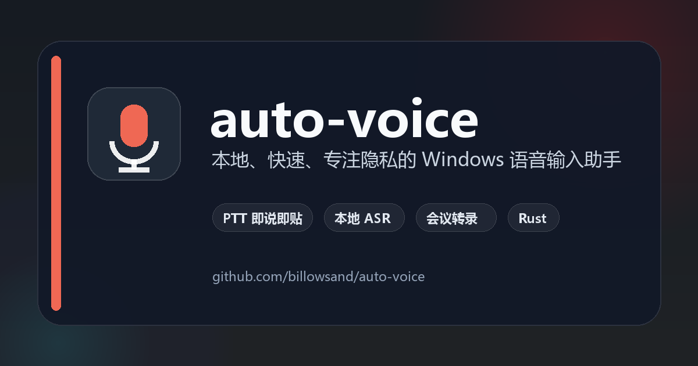

# auto-voice

<div align="center">

**面向 Windows、macOS 与 Linux 的本地语音转文字助手**

按住快捷键说话，松开即转录并粘贴；也可以将会议录音转换为带说话人标记的 Markdown。

[](https://github.com/billowsand/auto-voice/actions/workflows/ci.yml)
[](https://github.com/billowsand/auto-voice/releases/latest)
[](LICENSE)
[](https://www.rust-lang.org/)
[](#平台兼容性)

[快速开始](#快速开始) · [配置](#配置) · [命令行](#命令行使用) · [参与贡献](CONTRIBUTING.md)



</div>

> [!IMPORTANT]
> Windows 是当前主要发布平台；macOS 与 Linux 已纳入构建验证。语音模型需要单独下载，不包含在 Release 压缩包中。

## 为什么使用 auto-voice

- **高效 PTT 输入**：按住自定义快捷键录音，松开后自动识别、复制并粘贴。
- **边说边出字**：说话过程中浮层就显示已识别的内容，不必等到松手才知道识别得对不对。
- **完全本地 ASR**：基于 sherpa-onnx，支持 SenseVoice 与 FunASR-nano 后端。
- **会议录音整理**：转录 MP3、WAV、FLAC、OGG、M4A、MKV、AIFF 等格式，可选说话人分离。
- **可选 LLM 纠错**：连接本地 LM Studio，自动修正标点、同音词与口语表达。
- **专业词汇支持**：通过词典和 FST 规则替换同音专业词汇。
- **轻量桌面体验**：系统托盘常驻、录音状态 OSD，不依赖浏览器或云服务。
- **现代跨平台界面**：使用 eframe/egui 提供设置中心和半透明玻璃质感的听写浮层。

## 快速开始

### 1. 下载程序

从 [GitHub Releases](https://github.com/billowsand/auto-voice/releases/latest) 下载最新的 `auto-voice-*-windows-x86_64.zip`，解压到一个可写目录。

### 2. 准备模型

在程序所在目录创建 `models/`，最小可用的 SenseVoice 目录如下：

```text
models/
└── sense-voice/
    ├── model.int8.onnx
    └── tokens.txt
```

模型可从 [sherpa-onnx Releases](https://github.com/k2-fsa/sherpa-onnx/releases) 下载。更多后端和说话人分离模型见[模型目录](#模型目录)。

### 3. 启动 PTT

```powershell
.\auto-voice.exe
```

首次运行会弹出引导窗口：选一个按住说话的快捷键，确认模型与文本优化后即可开始使用，窗口会收进系统托盘。之后每次启动都直接静默驻留托盘，不再打扰。

按住配置的 `ptt_key` 讲话时，光标附近会弹出一张半透明卡片：左边是实时音量波形，下面是**已经识别出来的文字**——不用等说完就能看到自己在说什么。松开后，本地识别与 AI 整理接手，最终文本自动粘贴到当前输入框，卡片展示一下就淡出。设置中心里的改动即时生效，换模型也只是后台重新加载，都不需要重启程序。

## 功能概览

| 功能 | 说明 |
| --- | --- |
| 系统托盘 PTT | 无参数启动后驻留托盘，单击图标或右键菜单打开设置中心，麦克风仅在按住快捷键时开启 |
| 首次运行引导 | 三步选好快捷键与文本优化，之后启动不再弹窗 |
| 即时生效 | 设置保存后立刻应用；切换识别模型只在后台重载，无需重启 |
| 音频文件转录 | 输出 Markdown，可处理常见音频与容器格式 |
| 实时麦克风识别 | 使用 VAD 自动分段，结果写入剪贴板或文件 |
| 说话人分离 | 为会议转录标记不同说话人，支持指定人数 |
| LLM 文本纠错 | 兼容 LM Studio 的本地 OpenAI 风格接口 |
| 同音词规则 | 使用 sherpa-onnx Homophone Replacer 和自定义 FST |

## 模型目录

```text
models/
├── sense-voice/
│   ├── model.int8.onnx
│   └── tokens.txt
├── funasr-nano/
│   ├── encoder_adaptor.int8.onnx
│   ├── llm.int8.onnx
│   ├── embedding.int8.onnx
│   ├── merges.txt
│   ├── tokenizer.json
│   └── vocab.json
├── speaker-diarization/
│   ├── sherpa-onnx-pyannote-segmentation-3-0/
│   │   └── model.int8.onnx
│   └── 3dspeaker/
│       └── 3dspeaker_speech_eres2net_large_sv_zh-cn_3dspeaker_16k.onnx
└── hr/
    ├── lexicon.txt
    └── replace.fst
```

只有所启用功能对应的模型是必需的。`models/` 已被 Git 忽略，避免误提交大型模型文件。

## 配置

可从托盘菜单打开设置中心，也可以直接编辑 `config.toml`。程序按以下顺序加载配置：命令行参数 → 当前目录 `config.toml` → 旧版平台配置路径 → 系统标准配置目录 → 内置默认值。

```toml
asr_backend = "sense-voice"
model = "models/sense-voice/model.int8.onnx"
tokens = "models/sense-voice/tokens.txt"
lang = "auto"

# 支持单键或组合键，例如 LeftCtrl+LeftAlt
ptt_key = "RightAlt"
# 可选：指定麦克风名称；也可以直接在设置页选择
# input_device = "麦克风 (USB Audio Device)"

# 首次运行引导完成后由程序写入；删掉它可以重新走一遍引导
setup_done = true
# 浮层是否跟随光标弹出，false 时固定在屏幕底部中央
overlay_follow_caret = true
# 说话过程中就在浮层上显示已识别的文字。关掉可以省下后台的识别开销
overlay_live_preview = true

# 可选：从系统字体中选择设置页与浮层字体，靠前的字体优先
ui_font_families = ["Microsoft YaHei", "Segoe UI"]

# LM Studio 纠错；无需纠错时设置为 true
lm_url = "http://localhost:1234"
lm_model = "local-model"
no_llm = true

# 可选：启动 AutoVoice 时无界面启动本机 LM Studio 并加载模型
# lm_model 是 API 请求使用的标识；lmstudio_model 是 `lms ls` 中的 modelKey
lmstudio_auto_start = false
lmstudio_model = "qwen/qwen3.5-9b"
lmstudio_context_length = 4096

energy_threshold = 0.01
vad_silence_ms = 800
```

请勿在配置文件中填写 API 密钥；auto-voice 的 LM Studio 集成面向本地服务。

启用 `lmstudio_auto_start` 后，AutoVoice 会调用 LM Studio 自带的 `lms` CLI，依次启动
headless daemon、HTTP server，并按需加载 `lmstudio_model`。此功能仅接受
`http://localhost`、`http://127.0.0.1` 或 `http://[::1]` 地址；远程服务不会被自动管理。
首次使用前仍需至少手动启动一次 LM Studio，以完成 `lms` CLI 的初始化。

## 命令行使用

### 转录音频文件

```powershell
# 基本转录，默认生成同名 .md
.\auto-voice.exe transcribe meeting.mp3

# 指定输出文件
.\auto-voice.exe transcribe meeting.mp3 -o notes.md

# 说话人分离并指定人数
.\auto-voice.exe transcribe meeting.mp3 --diarize --speakers 3
```

### 实时麦克风识别

```powershell
# VAD 自动分段
.\auto-voice.exe listen

# 写入文件
.\auto-voice.exe listen -o live.txt

# 命令行 PTT 模式
.\auto-voice.exe listen --ptt
```

### 查看设备与配置

```powershell
.\auto-voice.exe info
.\auto-voice.exe --help
```

### 全局参数

| 参数 | 说明 |
| --- | --- |
| `--lm-url <URL>` | LM Studio API 地址 |
| `--lm-model <NAME>` | LM Studio 模型名 |
| `--no-llm` | 跳过 LLM 纠错 |
| `--asr-backend <NAME>` | `sense-voice` 或 `funasr-nano` |
| `--lang <LANG>` | `auto`、`zh`、`en`、`ja`、`ko`、`yue` |
| `--model <PATH>` | SenseVoice ONNX 模型路径 |
| `--tokens <PATH>` | SenseVoice `tokens.txt` 路径 |

完整参数以 `auto-voice --help` 和子命令的 `--help` 输出为准。

## 同音字替换

在 `tools/user-words.txt` 中按“拼音 + Tab + 目标文字”的格式添加规则：

```text
zhi4neng2ji4suan4	智能计算
```

使用 Python 3.8–3.13 环境生成 FST：

```powershell
python -m pip install kaldifst
python tools/build_hr_rules.py
```

然后配置：

```toml
hr_lexicon = "models/hr/lexicon.txt"
hr_rule_fsts = "models/hr/replace.fst"
```

`lexicon.txt` 可从 [sherpa-onnx hr-files](https://github.com/k2-fsa/sherpa-onnx/releases/tag/hr-files) 下载。

## 从源码构建

要求：Rust 1.92 或更高版本。Linux 还需要 ALSA、GTK3、AppIndicator、X11/Wayland 对应的开发包。

```powershell
git clone https://github.com/billowsand/auto-voice.git
cd auto-voice
cargo build --release --locked
```

生成文件位于 `target/release/`。Release 配置启用了 Thin LTO、符号裁剪和 `panic = "abort"`。

## 平台兼容性

- **Windows 10/11**：支持全局 PTT、自动粘贴、托盘与精确定位 OSD。
- **macOS**：支持相同核心功能；全局 PTT 和自动粘贴需要辅助功能/输入监控权限，粘贴使用 Command+V。
- **Linux X11**：支持全局 PTT；托盘和录音依赖发行版提供 GTK/AppIndicator 与 ALSA/PipeWire 组件。
- **Linux Wayland**：设置、录音和转录核心可运行；全局 PTT 等待 XDG GlobalShortcuts Portal 后端，OSD 位置由合成器决定。

详细设计和降级策略见 [跨平台 UI 设计](docs/cross-platform-ui-design.md)。

## 项目状态与限制

- 当前预构建 Release 仍以 Windows 为主，macOS/Linux 打包与权限引导仍在完善。
- 模型文件体积较大，需要用户自行下载并遵守对应模型许可证。
- 说话人分离会显著增加模型加载时间和内存占用。
- LLM 纠错是可选功能，默认可通过 `no_llm = true` 完全关闭。

## 贡献与安全

欢迎提交 Issue 和 Pull Request。开始前请阅读 [CONTRIBUTING.md](CONTRIBUTING.md)。

安全问题请不要公开提交 Issue，请按照 [SECURITY.md](SECURITY.md) 使用 GitHub Security Advisories 私下报告。版本变化见 [CHANGELOG.md](CHANGELOG.md)。

## 许可证

项目源码使用 [MIT License](LICENSE)。语音识别模型、说话人模型和其他下载资源可能采用不同许可证，使用前请查阅各自发布页面。
